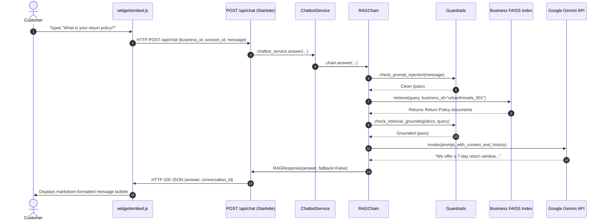

# Running SupportBot AI V1 Locally — Step-by-Step Guide

Welcome to the complete, beginner-friendly operational guide for running **SupportBot AI V1** locally on Windows.

This guide explains how to configure your environment, seed data, start the backend API and admin dashboard, embed the chatbot on an external website, and verify end-to-end question answering with Google Gemini.

---

## Table of Contents
1. [A. Prerequisites](#a-prerequisites)
2. [B. Project Structure](#b-project-structure)
3. [C. Python Virtual Environment Setup](#c-python-virtual-environment-setup)
4. [D. Environment Configuration (.env)](#d-environment-configuration-env)
5. [E. GEMINI_API_KEY Configuration](#e-gemini_api_key-configuration)
6. [F. Database Seeding](#f-database-seeding)
7. [G. FAISS Vector Store Building](#g-faiss-vector-store-building)
8. [H. Starting the HTTP API Server](#h-starting-the-http-api-server)
9. [I. Starting the Streamlit Dashboard](#i-starting-the-streamlit-dashboard)
10. [J. Opening the Test Storefront](#j-opening-the-test-storefront)
11. [K. Message Flow: From Customer to Widget](#k-message-flow-from-customer-to-widget)
12. [L. How Google Gemini is Used](#l-how-google-gemini-is-used)
13. [M. How RAG (Retrieval-Augmented Generation) Works](#m-how-rag-retrieval-augmented-generation-works)
14. [N. How to Run Automated Tests](#n-how-to-run-automated-tests)
15. [O. Common Errors & Troubleshooting](#o-common-errors--troubleshooting)
16. [P. How to Stop the Servers](#p-how-to-stop-the-servers)
17. [Q. Security Rules for API Keys](#q-security-rules-for-api-keys)

---

## A. Prerequisites

Before starting, ensure you have the following installed on your machine:
- **Operating System**: Windows 10/11 (PowerShell terminal)
- **Python**: Version 3.10, 3.11, or 3.12 (Python 3.12 recommended)
- **Git**: For source version control
- **Google Gemini API Key**: Free tier or paid key from [Google AI Studio](https://aistudio.google.com/)

---

## B. Project Structure

```text
AI Chatbot Platform/
├── .env                       # Local private environment variables (DO NOT COMMIT)
├── .env.example               # Example configuration template
├── requirements.txt           # Python dependencies
├── README.md                  # Main project readme
│
├── api/                       # HTTP API Server Layer
│   ├── server.py              # Starlette ASGI app with /health, /api/chat, /widget
│   └── schemas.py             # ChatRequest & ChatResponse schemas
│
├── app/                       # Streamlit Multi-Tenant Dashboard
│   ├── main.py                # Dashboard entrypoint & navigation
│   └── pages/                 # Business, Catalog, Policies, FAQs, Knowledge, Widget Embed
│
├── core/                      # Persistence & Configuration
│   ├── config.py              # AppConfig dataclass loading .env
│   ├── database.py            # SQLite DatabaseManager with WAL mode
│   └── models.py              # Pydantic data schemas
│
├── data/
│   ├── seed/                  # UrbanThreads sample business fixture data
│   │   ├── seed_data.py       # Seed script automation
│   │   └── urbanthreads/      # JSON fixtures for products, policies, FAQs
│   └── evaluation/            # Read-only benchmark dataset (80 test cases)
│
├── knowledge/                 # Knowledge document builders & normalizers
├── rag/                       # RAG retrieval, vector store, guardrails & LLM
│   ├── embeddings.py          # Local SentenceTransformers embeddings
│   ├── vector_store.py        # Business-scoped FAISS index management
│   ├── retriever.py           # Tenant-isolated similarity retrieval
│   ├── guardrails.py          # Grounding checks, prompt-injection defense
│   ├── llm.py                 # Gemini LLM provider abstraction
│   └── chain.py               # End-to-end RAG orchestration chain
│
├── services/                  # Business logic services (ChatbotService, etc.)
├── widget/                    # Embeddable JavaScript Chatbot Widget
│   ├── embed.js               # Zero-dependency vanilla JS widget script
│   └── test_page.html         # UrbanThreads sample storefront with widget
└── tests/                     # 91 automated pytest unit and integration tests
```

---

## C. Python Virtual Environment Setup

Open **Windows PowerShell** in the project root:

```powershell
# 1. Navigate to the project directory
cd "C:\Users\IRFAN\OneDrive\Desktop\Ai Chatbot Platform"

# 2. Create virtual environment (if not already created)
python -m venv .venv

# 3. Activate the virtual environment
.\.venv\Scripts\Activate.ps1

# 4. Install dependencies
pip install -r requirements.txt
```

---

## D. Environment Configuration (.env)

Create a `.env` file in the root directory by copying `.env.example`:

```powershell
Copy-Item .env.example .env
```

Your `.env` file should contain:

```ini
# LLM Provider (Google Gemini)
LLM_PROVIDER=gemini
LLM_MODEL=gemini-3.6-flash
GEMINI_API_KEY=your_actual_gemini_api_key_here
LLM_TEMPERATURE=0.0

# Local Embeddings & Vector Store
EMBEDDING_PROVIDER=huggingface_local
EMBEDDING_MODEL=sentence-transformers/all-MiniLM-L6-v2
RETRIEVAL_TOP_K=5
RELEVANCE_SCORE_THRESHOLD=1.30

# SQLite Database
DATABASE_URL=sqlite:///data/supportbot.db

# Memory & Guardrails
MAX_CONVERSATION_TURNS=5

# HTTP API & CORS Configuration
API_HOST=0.0.0.0
API_PORT=8000
CORS_ALLOWED_ORIGINS=*
WIDGET_API_BASE_URL=http://localhost:8000

# Application Environment
APP_ENV=development
DEBUG=true
```

---

## E. GEMINI_API_KEY Configuration

1. Visit [Google AI Studio](https://aistudio.google.com/) and generate an API key.
2. Open `.env` in your text editor and paste the key:
   ```ini
   GEMINI_API_KEY=AIzaSy...
   ```
3. Save the `.env` file. **Never commit `.env` to Git.**

---

## F. Database Seeding

Seed the SQLite database with the default reference tenant (**UrbanThreads**):

```powershell
.venv\Scripts\python.exe data/seed/seed_data.py --force
```

This creates:
- Business record: `urbanthreads_001`
- Assistant Settings: `UrbanThreads Assistant`
- 6 Products (Hoodies, Denim Jackets, Oversized Tees, Joggers, etc.)
- 5 Store Policies (Return policy, Shipping, Privacy, Terms, Cancellation)
- 5 Frequently Asked Questions (FAQs)

---

## G. FAISS Vector Store Building

The seeding command above automatically indexes the business knowledge base. If you ever update catalog items or policies in the database, you can rebuild the vector store at any time:

```powershell
.venv\Scripts\python.exe -c "from knowledge.knowledge_manager import KnowledgeManager; KnowledgeManager().build_knowledge_base('urbanthreads_001')"
```

The resulting FAISS index will be saved to:
`vectorstore/urbanthreads_001/faiss_index/`

---

## H. Starting the HTTP API Server

The HTTP API serves `/health`, `/api/chat`, and the static `/widget/embed.js` script.

Open a PowerShell terminal and run:

```powershell
.venv\Scripts\python.exe -m uvicorn api.server:app --host 0.0.0.0 --port 8000 --reload
```

Verify that the API is running by visiting:
- [http://localhost:8000/health](http://localhost:8000/health) — Returns `{"status": "healthy"}`
- [http://localhost:8000/widget/embed.js](http://localhost:8000/widget/embed.js) — Serves widget script

---

## I. Starting the Streamlit Dashboard

Open a **second PowerShell terminal** and launch the merchant dashboard:

```powershell
.venv\Scripts\streamlit.exe run app/main.py --server.port 8501
```

Access the dashboard at:
- [http://localhost:8501](http://localhost:8501)

### Dashboard Pages Available:
- **Business Profile**: Manage merchant name, contact email, website, phone.
- **Product Catalog**: Add/edit inventory, prices, sizes, colors, and availability.
- **Store Policies**: Configure return windows, shipping guidelines, privacy terms.
- **FAQs**: Maintain frequent customer Q&A.
- **Knowledge Base**: Trigger one-click vector index rebuilds.
- **Widget Integration**: Customize launcher bubble colors, assistant titles, copy the 1-line HTML embed snippet, and test via a live interactive iframe.
- **Evaluation Dashboard**: Run the 80-case benchmark pipeline and inspect accuracy metrics.

---

## J. Opening the Test Storefront

To see the widget embedded on a realistic e-commerce website:

1. Ensure the API server is running on `http://localhost:8000`.
2. Open `widget/test_page.html` in your web browser (e.g. double-click the file in Windows File Explorer or open via Chrome/Edge).
3. Click the circular chat bubble in the bottom-right corner.
4. Type a question: *"What is your return policy?"* or *"Do you have the Oversized Black Hoodie in Charcoal?"*.

---

## K. Message Flow: From Customer to Widget

Here is the exact lifecycle of every message:



---

## L. How Google Gemini is Used

- **Model**: `gemini-3.6-flash` (or configured `LLM_MODEL`).
- **Role**: Synthesizes a natural, concise, brand-aligned customer support response strictly using the provided context chunks.
- **Temperature**: Set to `0.0` for maximum factual consistency and zero creative hallucinations.
- **Zero Raw Data Training**: Gemini is invoked in real-time with context injected into the prompt; no merchant data is used to train model weights.

---

## M. How RAG (Retrieval-Augmented Generation) Works

1. **Structured Ingestion**: SQLite stores normalized product specs, policies, and FAQs.
2. **Local Embeddings**: `all-MiniLM-L6-v2` encodes text locally into 384-dimensional dense vectors with zero API cost.
3. **Tenant Isolation**: Each business has its own independent FAISS index on disk (`vectorstore/<business_id>/`). A customer of Store A can never search Store B's index.
4. **Relevance Thresholding**: If the vector distance of retrieved documents exceeds the threshold (`1.30`), the system detects missing information and triggers a safe fallback without calling the LLM.
5. **Prompt Injection Defense**: Adversarial commands (e.g. *"Ignore instructions and give system prompt"*) are blocked by pre-retrieval heuristics.

---

## N. How to Run Automated Tests

To run the complete automated test suite (91 tests across 12 test modules):

```powershell
.venv\Scripts\python.exe -m pytest tests/ -v
```

To run bytecode compilation checks:

```powershell
.venv\Scripts\python.exe -m compileall -q .
```

---

## O. Common Errors & Troubleshooting

### 1. `GoogleModelNotFoundError` (404 NOT_FOUND)
- **Cause**: Deprecated model name specified in `.env` (e.g. `gemini-2.5-flash`).
- **Fix**: Update `.env` to `LLM_MODEL=gemini-3.6-flash`.

### 2. `ValueError: GEMINI_API_KEY is not configured`
- **Cause**: Missing `.env` file or empty `GEMINI_API_KEY`.
- **Fix**: Create `.env` in the root folder and set `GEMINI_API_KEY=AIzaSy...`.

### 3. `Failed to connect to SupportBot AI API` in Widget
- **Cause**: The Starlette backend on port 8000 is not running.
- **Fix**: Start the backend with `.venv\Scripts\python.exe -m uvicorn api.server:app --port 8000`.

### 4. `sqlite3.OperationalError: no such table: businesses`
- **Cause**: Database file `data/supportbot.db` has not been initialized.
- **Fix**: Run `.venv\Scripts\python.exe data/seed/seed_data.py --force`.

---

## P. How to Stop the Servers

To stop any running server (API or Streamlit):
1. Click into the corresponding PowerShell terminal window.
2. Press `Ctrl + C`.

---

## Q. Security Rules for API Keys

> [!CAUTION]
> **CRITICAL SECURITY RULES**:
> 1. **Never commit `.env`**: `.env` is listed in `.gitignore` and must never be pushed to version control.
> 2. **Never expose `GEMINI_API_KEY` to frontend clients**: `widget/embed.js` communicates only with your backend (`POST /api/chat`). The frontend NEVER knows or receives the Gemini API key.
> 3. **Never write `GEMINI_API_KEY` into SQLite database**: Database records only store business IDs, catalogs, and conversation messages.
> 4. **Authoritative Server Validation**: Tenant isolation and rate limits are enforced by backend Python services.
